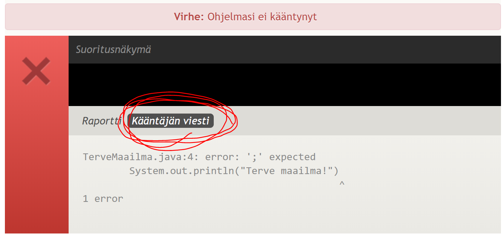
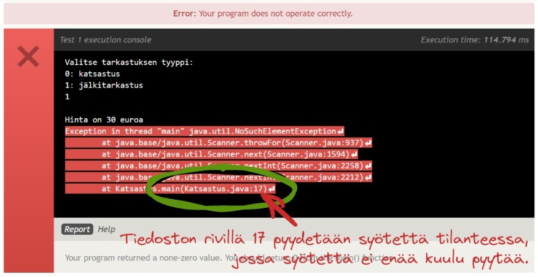

[&larr; Takaisin etusivulle](/)


<h1 class="js-toc-ignore">Ohjelmoinnin aloitus</h1>

Tällä oppitunnilla tutustumme Java-lähdekooditiedostojen rakenteeseen sekä koodin kirjoittamiseen ja suorittamiseen Eclipse-sovelluskehittimessä. Käsittelemme numeerisia sekä tekstimuotoisia tietotyyppejä ja teemme yksinkertaista vuorovaikutusta käyttäjän kanssa tulosteiden ja syötteiden avulla. Lopuksi tunnilla opittuja asioita harjoitellaan Viope-järjestelmässä olevien tehtävien avulla.

**Sisällysluettelo**

<div class="js-toc"></div>

# Oppitunnin videot

Videoiden katsominen edellyttää liittymistä kurssin Teams-ryhmään ja kirjautumista MS Stream -palveluun Haaga-Helian käyttäjätunnuksellasi.

## [Kurssin yleiset asiat](https://web.microsoftstream.com/video/f8cafe9c-976c-4f00-9713-4a8adc8d34bd) *10:54*

<iframe width="640" height="360" src="https://web.microsoftstream.com/embed/video/f8cafe9c-976c-4f00-9713-4a8adc8d34bd?autoplay=false&showinfo=true" allowfullscreen style="border:none;"></iframe>

Tällä videolla tutustumme kurssin sisältöön ja arviointiin sekä kurssilla käytettäviin ohjelmiin ja web-palveluihin.

* [Viope](https://hh.viope.com/)
* [Javan lataussivu (JDK)](https://www.oracle.com/technetwork/java/javase/downloads/index.html)
* [Eclipsen lataussivu](https://www.eclipse.org/downloads/packages/)


## [Ensimmäisen Java-ohjelman kirjoittaminen ja lähetys Viopeen](https://web.microsoftstream.com/video/00c2134a-6187-46d7-a7ac-da7218ff4a10) *41:46*

<iframe width="640" height="360" src="https://web.microsoftstream.com/embed/video/00c2134a-6187-46d7-a7ac-da7218ff4a10?autoplay=false&showinfo=true" allowfullscreen style="border:none;"></iframe>

Tällä videolla tutustumme Java-lähdekooditiedostojen sisältöön ja editointiin Eclipse-koodieditorilla. Luomme uuden projektin, jota käytetään kurssilla jatkossa oppitunneilla ja viikkoharjoitusten koodaamiseen. Lähetämme ensimmäisen tehtävän ratkaisun Viopeen ja tutustumme tyypillisimpiin virhetilanteisiin, joiden vuoksi Viope ei välttämättä hyväksy lähettämääsi ratkaisua.

[Videon lähdekoodit](https://github.com/ohjelmointi1/ohjelmointi1-3012/tree/main/src/viikko01/perusteet)


## [Javan muuttujat ja lukujen tietotyypit](https://web.microsoftstream.com/video/e5771426-2a6d-4aa4-be5b-ecd7dbe03805) *1:03:33*

<iframe width="640" height="360" src="https://web.microsoftstream.com/embed/video/e5771426-2a6d-4aa4-be5b-ecd7dbe03805?autoplay=false&showinfo=true" allowfullscreen style="border:none;"></iframe>

Tällä videolla tutustumme Javan tietotyyppeihin, niiden ominaisuuksiin sekä rajoitteisiin. Opimme valitsemaan oikean lukutyypin `int`, `long` ja `double` vaihtoehdoista käyttötarpeen mukaan ja käyttämään eri tyyppisiä muuttujia. Muokkaamme myös Eclipsen asetuksia siten, että lähdekooditiedostoissa esiintyvät erikoismerkit ja ääkköset näkyvät oikein.

[Videon lähdekoodit](https://github.com/ohjelmointi1/ohjelmointi1-3012/tree/main/src/viikko01/perusteet)


## [Scanner ja DecimalFormat](https://web.microsoftstream.com/video/72835f81-cea0-45e8-b2fe-7deb472eb8fd) *37:23*

<iframe width="640" height="360" src="https://web.microsoftstream.com/embed/video/72835f81-cea0-45e8-b2fe-7deb472eb8fd?autoplay=false&showinfo=true" allowfullscreen style="border:none;"></iframe>

Tällä videolla katsomme, miten käyttäjän teksti- ja numeromuotoisia syötteitä voidaan lukea ja käsitellä Javan **Scanner**-työkalun avulla. Tutustumme lisäksi **DecimalFormat**-työkaluun, jonka avulla voimme määritellä liukulukujen tulostuksessa käytettävän tarkkuuden. 

Lähdekoodit: [SyotteidenLukeminen.java](https://github.com/ohjelmointi1/ohjelmointi1-3012/blob/main/src/viikko01/perusteet/SyotteidenLukeminen.java), 
[NumeroidenLukeminen.java](https://github.com/ohjelmointi1/ohjelmointi1-3012/blob/main/src/viikko01/perusteet/NumeroidenLukeminen.java)


# Java-lähdekooditiedostot

Java-ohjelmat koostuvat aina **luokista** (class). Tyypillisesti kukin luokka tallennetaan omaan `.java`-päätteiseen tiedostoonsa. Tiedoston sisällä ohjelmakoodi kirjoitetaan ns. luokan sisään:

```java
// Tiedosto HelloWorld.java
public class HelloWorld {

}
```

Sekä tiedoston että luokan nimi kirjoitetaan isolla alkukirjaimella ja kaikki sanat yhteen. On myös tärkeää, että nimi sekä sen kirjainkoko on täsmälleen samalla tavalla sekä luokassa että tiedostossa.

Ohjelman varsinaiset käskyt kirjoitetaan niin sanottuihin **metodeihin**. Metodit ovat hyvin samankaltaisia kuin monissa kielissä käytettävät funktiot. Metodit koostuvat käskyistä, jotka kirjoitetaan omille riveilleen, ja rivit päätetään puolipisteellä:


```java
// Tiedosto HelloWorld.java
public class HelloWorld {

    // Kaikki metodit kirjoitetaan luokan sisään
    public static void main(String[] args) {

        // Tekstiä voidaan tulostaa System.out.println-komennolla:
        System.out.println("Hello world!");

    }
}
```


Javassa `main`-metodilla on erityinen rooli: ohjelman suoritus alkaa main-metodista. Tätä koodia suoritettaessa ohjelma käynnistyy siis main-metodista ja ruudulle tulostuu teksti `Hello world!`. `main`-metodin määrittelyssä esiintyviin muihin sanoihin ja erikoismerkkeihin palaamme myöhemmin.

Tulostettava teksti on kirjoitettu koodissa lainausmerkkeihin `"Hello world!"`, koska se ei ole suoritettavaa koodia, vaan tekstidataa. Tekstimuotoista dataa kutsutaan ohjelmoinnin yhteydessä **merkkijonoiksi** (eng. string).


# Java-kielisen ohjelman suorittaminen

Yllä oleva esimerkkikoodi voidaan tallentaa ja suorittaa Eclipsessä esimerkiksi run-painikkeella. Suorituksen aikana Eclipsen Console-välilehdelle tulostuu haluamamme teksti, ja ohjelman suoritus päättyy. Java-kielisen ohjelman suorittamiseen liittyy kuitenkin eri välivaiheita, jotka Eclipse suorittaa taustalla automaattisesti.

Java on **käännettävä ohjelmointikieli**. Käytännössä se tarkoittaa sitä, että ohjelmoija kirjoittaa lähdekoodin "ihmisen ymmärrettävään muotoon", eli Java-kielisinä komentoina ja rakenteina, kuten yllä.

Tämän jälkeen Java-koodi **käännetään tavukoodiksi**, joka on eräänlainen välimuoto ihmisen ja tietokoneen ymmärtämien kielten välillä. Lopulta käännetty **tavukoodi** voidaan suorittaa Javan **virtuaalikoneella** (JVM), joka tulkkaa käskyt kunkin käyttöjärjestelmän mukaisiksi konekielisiksi komennoiksi. 

Java-ohjelmistopakettia tarjotaan usein erilaisina versioina riippuen siitä, oletko aikeissa vain suorittaa Java-koodia vai oletko myös kehittämässä uutta koodia. Tällä kurssilla tarvitsemme erityisesti JDK-version (Java SE Development Kit), joka sisältää työkalut ohjelmien kääntämiseksi.

> **JDK (Java SE Development Kit)**
>
> *For Java Developers. Includes a complete JRE plus tools for developing, debugging, and monitoring Java applications.*
>
> **JRE (Java Runtime Environment)**
>
> *Contains everything required to run Java applications on your system.*
>
> Oracle. Which Java package do I need? [https://www.oracle.com/java/technologies/javase-downloads.html](https://www.oracle.com/java/technologies/javase-downloads.html)

## Kääntämisen edut

Koska koodi käännetään ennen suoritusta, tarkistaa kääntäjä koodin syntaksisen oikeellisuuden jo ennen koodin suorittamista. Näin esimerkiksi huolimattomuusvirheet, kuten puuttuvat merkit ja kirjoitusvirheet, havaitaan jo ennen koodin suorittamista nopeasti.

Koska Java-koodi käännetään tavukoodiksi eikä suoraan tietyn järjestelmän mukaisiksi käskyiksi, voidaan samaa käännettyä Java-ohjelmaa suorittaa hyvin erilaisilla järjestelmillä. Kunkin järjestelmän Java-virtuaalikone pystyy tulkitsemaan saman käännetyn ohjelman käskyt omiksi komennoikseen. Javan kehittäjien slogan oli aikanaan tämän ominaisuuden mukaisesti ["Write once, run anywhere"](https://en.wikipedia.org/wiki/Write_once,_run_anywhere).


# Eclipse-sovelluskehitin

Eclipse automatisoi lähdekoodin kääntämisen ja tekee ohjelman suorituksesta helppoa. Et kenties tule edes huomaamaan, että ohjelmointiin liittyy kyseinen välivaihe. Eclipse kuitenkin kääntää Java-koodisi automaattisesti aina kun tallennat tiedoston ja kertoo, mikäli kääntäjä havaitsi koodissasi virheitä.

Eclipsen käyttöliittymään ilmestyvät punaiset ja keltaiset virheet ja varoitukset ovat Java-kääntäjän havaitsemia ongelmia.


## Eclipsen käyttö ja ensimmäinen Viope-tehtävä

1. Avaa koneeltasi Eclipse-sovelluskehitin
1. Eclipse pyytää aluksi valitsemaan työtilan (workspace), eli hakemiston tiedostojen tallennusta varten
    * Luo työtila haluamaasi hakemistoon (kampuksen koneilla esim. M-asemalle)
    * Sulje Eclipsen mahdollisesti näyttämä "Welcome"-ruutu yläkulman rastista.
1. Luo itsellesi uusi Java-projekti: (`File 🡪 New 🡪 Java project`)
1. Lisää projektiin uusi Java-luokka nimeltä TerveMaailma (`File 🡪 New 🡪 Class`) 
    * Voit halutessasi valita luokalle myös paketin (package), joka helpottaa lähdekooditiedostojen hallitsemista jakamalla ne erillisiin kansioihin.
    * Huomaa, että Eclipse nimeää tiedoston automaattisesti luokan nimiseksi.
1. Lisää luokkaan main-metodi, jonka sisällä tulostakaa merkkijono `"Terve maailma!"`
1. Suorita kirjoittamasi koodi (Eclipsen run-painike)
1. Eclipsen konsoliin pitäisi nyt tulostua toivottu teksti

Tämä oli samalla kurssin ensimmäinen Viope-tehtävä. Saatuasi koodin toimimaan omalla koneellasi, kopioi se Viopen tehtäväkenttään ja suorita koodi Viopessa. Viope ei tue tiedostojen paketteja, eli joudut poistamaan tiedoston alusta `package`-rivin, mikäli käytit pakettia luokkaa luodessasi.

Mikäli Viope hyväksyy ratkaisusi, voit tallentaa sen Viopeen, jolloin saat myös tehtävästä pisteet.

## Viopen tyypillisiä virhetilanteita

### "Could not find or load main class"

> <span style="color: red">Error: Could not find or load main class TerveMaailma
> Caused by: java.lang.NoClassDefFoundError: viikko1/perusteet/th/TerveMaailma (wrong name: TerveMaailma)</span>

Tämä virhe johtuu siitä, että Viope ei löydä toteuttamaasi luokkaa. Ongelma voi johtua joko virheellisesti nimetystä luokasta tai koodin alussa olevasta **package**-rivistä.

Vaikka ohjelmoisit omat ratkaisusi Eclipsessä hyvien käytäntöjen mukaisesti erillisiin paketteihin, tulee `package`-rivit poistaa aina palautettavien tiedostojen alusta. Viope ei tue paketteja tehtävien ratkaisuissa.

Vaikka ohjelma toimisi täysin oikein omalla Eclipselläsi, saattaa se aiheuttaa käännösvirheen, mikäli luokkasi nimi on eri kuin mitä Viope odottaa. Tarkista siis, että luokan nimi `public class Nimi { ... }` on kirjoitettu oikein kirjainkoko huomioiden.


### "Virhe tulostuksessa"

> Virhe tulostuksessa: ohjelmasi tulosti "maailma", vaikka tulostuksen olisi pitänyt olla "maailma!"

Vertaile merkki kerrallaan oman ohjelmasi tulostetta esimerkkitulosteeseen. Onko välimerkeissä tai numeroissa eroja? Entä kirjoitusvirheitä? Yllä olevassa esimerkkivirheessä oikeassa ratkaisussa on lopussa huutomerkki, joka puuttuu lähetetyn ratkaisun tulosteesta.


### "Virhe: ohjelmasi ei kääntynyt"

Jos luokassa on syntaksivirhe, ei kääntäjä pysty kääntämään ratkaisuasi eikä ohjelman suoritus ala lainkaan. Tällaisten tapausten välttämiseksi on tärkeää toteuttaa ja testata ratkaisusi aina ensin Eclipsessä, ja vasta sen jälkeen kopioida ainakin syntaksiltaan toimivaksi varmistettu ratkaisu Viopeen.

Nähdäksesi tarkemman virheilmoituksen Viopessa, avaa näkyville Java-kääntäjän antama virhe klikkaamalla "Kääntäjän viesti"-painiketta:



Painike on Viopessa hieman hankala ymmärtää klikattavaksi sen tyylistä johtuen. Kääntäjän viesti kertoo missä kohdassa koodiasi virhe on.


### java.util.NoSuchElementException



Mikäli ohjelmasi vaikuttaa toimivan Eclipsessä moitteetta, mutta saat Viopessa virheen `java.util.NoSuchElementException`, varmista, että ohjelmasi ei jää odottamaan lisää syötteitä käyttäjältä.

Mikäli ohjelma pyytää syötettä vielä sen jälkeen, kun Viope on antanut sille kaikki esimerkkisuorituksessa annetut syötteet, syntyy tämä `NoSuchElementException`. Kuvassa virheilmoitus kertoo `nextInt`-kutsusta rivillä 17, joka kaatoi ohjelman, koska kaikki syötteet oli jo luettu.


[Tyypillisiä virhetilanteita ja niiden ratkaisuja on dokumentoitu erilliselle sivulle.](/wiki/Viope)


# Tekstin ja lukujen tulostaminen

Javassa on erilaisia tietovirtoja, joilla voidaan tulostaa esim. tekstiä ja lukuja ruudulle.

`System.out` on oletustietovirta, johon voidaan tulostaa seuraavasti:

```java
System.out.println("tulostettava teksti"); // tekee rivinvaihdon loppuun
```

`println` tulostaa annetun arvon ja lopuksi aina rivinvaihdon, eli seuraava tuloste tulostuu eri riville. `print` tekee saman, mutta ilman rivinvaihtoa tulosteen loppuun:

```java
System.out.print("tulostettava teksti"); // ei tee rivinvaihtoa loppuun
```

`print`-metodia käytettäessä seuraava tuloste jatkuu samalle riville.


Kuten merkkijonoja, Javassa voidaan tulostaa myös lukuja sekä muita arvoja. Jos tulostettavan arvon paikalle ei laiteta "kovakoodattua arvoa", vaan esimerkiksi lauseke, lausekkeen arvo selvitetään aina ennen tulostamista:

```java
// vakiot tulostetaan sellaisenaan:
System.out.println(42);

// lausekkeet suoritetaan aina ennen tulostamista:
System.out.println(1 + 2); // 3
System.out.println(4 - 1); // 3
System.out.println(1 * 3); // 3
```


# Muuttujat

Ohjelmissa käytettäviä arvoja, esimerkiksi numeroita (`int`) tai merkkijonoja (`String`), voidaan pitää tallessa muuttujissa. 

Javassa muuttujilla on aina ennalta määritettävä tyyppi, joka määrää sen, minkä tyyppisiä arvoja kyseiseen muuttujaan voidaan asettaa, esim:

```java
int leveys; // luo uuden muuttujan (nimi: leveys, tyyppi: int)
```

Muuttujiin asetetaan arvoja sijoitusoperaattorilla (`=`):

```java
int leveys = 3; // luo uuden muuttujan ja asettaa siihen samalla arvon
```

Muuttujan tyyppi (esim. `int`) kirjoitetaan ainoastaan muuttujan määrittelyyn. Myöhemmillä kerroilla tyyppiä ei toisteta, vaan uusi arvo asetetaan esim. seuraavasti:

```java
leveys = 4;
```

Muuttujia voidaan käyttää myöhemmin esimerkiksi laskutoimituksissa kirjoittamalla luvun tilalle muuttujan nimi:

```java
int leveys = 2;
int korkeus = 3;

int ala = leveys * korkeus;

System.out.println(ala);

// asetetaan uusia arvoja:
leveys = 4;
korkeus = 6;

// mikä luku tulostuu viimeisenä?
System.out.println(ala);
```

Yllä oleva koodi tulostaa lopussa luvun 6, koska myöhemmin tehtävillä sijoitusoperaatioilla `leveys`- ja `korkeus`-muuttujiin ei ole vaikutusta `ala`-muuttujaan aikaisemmin asetettuun arvoon.

## Javan staattinen tyypitys

Java on ns. staattisesti tyypitetty kieli, eli kaikella datalla on olemassa tietty tyyppi, joka on ennalta määritetty. Muuttujien tapauksessa tyyppi määritellään muuttujaa luotaessa, eikä Java salli asettaa muuttujaan arvoja, jotka eivät ole yhteensopivia muuttujan tyypin kanssa.

Esimerkiksi `int`-tyyppisessä muuttujassa voidaan varastoida ainoastaan kokonaislukuja:

```java
int numero = 1;

numero = "kaksi"; // "Type mismatch: cannot convert from
                  // String to int"
```

Huomaa, että Javassa virhe tapahtuu jo ennen kuin ohjelmaa voidaan suorittaa. Tämä johtuu siitä, että Java on käännettävä ohjelmointikieli ja kääntäjä tarkistaa ohjelmakoodin ennen suoritusta.


## String-muuttuja

Kuten kokonaislukuja, myös merkkijonoja voidaan asettaa muuttujiin. Tällöin muuttujan tyypiksi määritellään `String`, eli merkkijono:

```java
String etunimi = "Matti";
```

Merkkijonoja voidaan yhdistää toisiinsa, eli katenoida, plus-merkillä `+`:

```java
String etunimi = "Matti";
String sukunimi = "Meikäläinen";

String kokonimi = etunimi + " " + sukunimi;

// Tulostaa tekstin: Matti Meikäläinen
System.out.println(kokonimi);
```

Yllä käytettyjen muuttujien tyyppi on `String`, eli niihin voidaan asettaa ainoastaan merkkijonoja. Muuttujan `kokonimi` kohdalla yhdistetään käytännössä kolme merkkijonoa toisiinsa. `etunimi` ja `sukunimi` muuttujien väliin on asetettu myös välilyönnin sisältävä merkkijono `" "`, jotta `"Matti Meikäläinen"` sisältää välilyönnin nimen osien välissä.

## Vakiot

Muuttuja voidaan myös määritellä "vakioksi", jolloin siihen asetettavaa arvoa ei voida enää korvata toisella arvolla. Tämä tehdään lisäämällä sana `final` muuttujan määrittelyn alkuun:

```java
public static void main(String[] args) {
    final int LAINA_AIKA = 28;
}
```

Vakiot kirjoitetaan pääasiassa isoilla kirjaimilla kuten yllä. Tässä tapauksessa muuttujan määrittely vakioksi voi olla perusteltua, koska päivien määrä viikossa ei saa muuttua ohjelman suorituksen aikana.

## Staattiset vakiot (edistynyttä sisältöä)

Jos samaa vakiota on tarpeellista käyttää saman luokan sisällä useissa metodeissa tai vaihtoehtoisesti useista luokista, ne voidaan määritellä myös `main`-metodin ulkopuolelle. Tällöin niiden eteen tulee kirjoittaa avainsana `static`:

```java
public class Myohastymismaksut {
    static final int LAINA_AIKA = 28;
    static final double MYOHASTYMISMAKSU_PV = 0.2;
    static final int MYOHASTYMISMAKSU_MAX = 6;

    public static void main(String[] args) {
        // staattiset vakiot ovat käytettävissä täällä!
    }
}
```

Palaamme `static`-avainsanaan ja useiden metodien kirjoittamiseen tarkemmin myöhemmin tällä kurssilla.

## Muuttujien nimeäminen

Hyvä lähde koodin tyylikäytäntöjen opetteluun on esimerkiksi [Google Java Style Guide](https://google.github.io/styleguide/javaguide.html#s5-naming):

* muuttujien nimissä voi olla kirjaimia, numeroita sekä tiettyjä erikoismerkkejä
* useimpien erikoismerkkien ja ääkkösten käyttöä ei kuitenkaan suositella
* muuttujan nimi ei saa alkaa numerolla
* usean sanan pituiset muuttujan nimet kirjoitetaan yhteen, jälkimmäiset sanat isoilla alkukirjaimilla (camelCase):

```java
String nykyinenKuukausi = "tammikuu";
int paivia = 31;
```

## Javan tietotyyppejä: kokonaisluvut (int ja long)

Javassa kokonaisluvut ovat oletuksena tyyppiä `int` (integer). `int` on 32-bittinen kokonaisluku väliltä  -2&nbsp;147&nbsp;483&nbsp;648 – 2&nbsp;147&nbsp;483&nbsp;647, esim:

```java
int saunanLampotila = 80;
int pakastimenLampotila = -19;

int suomenVakiluku = 5_518_000;
int suurinInt = 2_147_483_647;
```

Vaikka `int` tyyppi toimii hyvin erittäin monissa tarkoituksissa, ei sen suuruus riitä esittämään Suomen varakkaimman henkilön varallisuutta tai maailman väkilukua. Kun tarvitaan `int`-tyyppiä suurempia kokonaislukuja, voidaan käyttää `long`-tyyppiä.

`long` on 64-bittinen kokonaisluku väliltä -9&nbsp;223&nbsp;372&nbsp;036&nbsp;854&nbsp;775&nbsp;808 – 9&nbsp;223&nbsp;372&nbsp;036&nbsp;854&nbsp;775&nbsp;807.

Luku voidaan määritellään long-tyyppiseksi kirjoittamalla sen perään L-kirjain: 

```java
long maailmanVakiluku = 7_838_721_501L;
long suurinLong = 987_654_321_098_765_432L;
```

Suurten lukujen hahmottaminen ilman välimerkkejä voi olla hankalaa. Java ei salli välilyöntejä numeroissa, mutta [alaviivan käyttö erottimena on sallittua](https://docs.oracle.com/javase/7/docs/technotes/guides/language/underscores-literals.html).

```java
long vaikeaHahmottaa = 987654321098765432L;
long helpompiHahmottaa = 987_654_321_098_765_432L;
```

`int` ja `long`-tyyppien lisäksi on olemassa pienemmät lukutyypit `byte` ja `short`, joita tarvitaan harvoin. Mikäli puolestaan tarvitaan `long`-tyyppiä suurempia lukuja, voidaan käyttää [BigInteger](https://docs.oracle.com/en/java/javase/11/docs/api/java.base/java/math/BigInteger.html)-luokkaa

## Kokonaislukujen "ylivuoto"

Jos laskutoimituksen tulos on suurempi tai pienempi, kuin mitä kyseinen lukutyyppi pystyy esittämään, tapahtuu ns. ylivuoto, eli numero "pyörähtää ympäri".

Kokeile suorittaa seuraavat rivit. Mitä tuloksia saat ja miksi?

```java
// int-luvun ylivuoto:
System.out.println(2_147_483_647);
System.out.println(2_147_483_647 + 1);

// Sama long-tyyppisellä luvulla
System.out.println(2_147_483_647L + 1);
```

**Huom!** Kokonaislukujen ylivuoto ei niinkään liity Javaan, vaan yleisesti siihen, miten luvut esitetään tietokoneen muistissa ykkösten ja nollien avulla.

### "Y2K38"-ongelma

Vaikka kokonaislukujen pyörähtäminen ympäri voi tuntua epäolennaiselta ongelmalta, vaikuttaa se mm. tietokoneen kellon toimintaan. Tietojenkäsittelyssä aikaa mitataan usein sekunteina alkaen ajanhetkestä 1.1.1970, jolloin 32-bittisten [järjestelmien kello saattaa teknisestä toteutuksesta riippuen pyörähtää ympäri 19.1.2038](https://fi.wikipedia.org/wiki/Y2K38). Alla oleva animaatio havainnollistaa 32-bittisen etumerkillisen luvun käyttäytymistä kyseisenä päivänä:

> 
> 
> *By Monaneko - Oma teos, Public Domain, [https://commons.wikimedia.org/w/index.php?curid=1711901](https://commons.wikimedia.org/w/index.php?curid=1711901)*

Pystytkö vaihtamaan puhelimesi kellonajaksi yli 19.1.2038? [Se ei välttämättä onnistu](https://www.is.fi/taloussanomat/art-2000001783335.html) käytetyn lukutyypin rajallisuudesta johtuen.

## Javan tietotyyppejä: liukuluvut (double)

Tietojenkäsittelyssä desimaalilukuja käsitellään tyypillisesti liukulukuina. Liukuluku-termi tulee siitä, että luvussa kokonais- ja desimaaliosille ei ole varattu kiinteää määrää bittejä, vaan pisteen paikka "liukuu" sen mukaan, kuinka suuresta tai pienestä luvusta on kyse.

Yleisin liukulukutyyppi Javassa on `double`, jossa kokonais- ja desimaaliosa erotetaan toisistaan pisteellä:

```java
double pii = 3.141592;

// Javassa on myös valmis arvo piille: Math.PI
// https://docs.oracle.com/javase/8/docs/api/java/lang/Math.html#PI
```

Double-tyypin tarkkuus desimaalilukuna on noin 15 numeroa, esimerkiksi `1234567.89012345`. Yllä esitetty piin likiarvo voidaan double-tyyppisenä esittää tarkimmillaan luvulla `3.141592653589793`.

Lisäksi on olemassa myös epätarkempi `float`, jota käytetään nykyään lähinnä silloin, kun lukuja on valtavia määriä ja niiden tarkkuudesta voidaan tinkiä.

Mikäli puolestaan tarvitaan `double`-tyyppiä tarkempia desimaaleja, voidaan käyttää [BigDecimal](https://docs.oracle.com/javase/7/docs/api/java/math/BigDecimal.html)-luokkaa.


## Laskuvirheet liukuluvuilla

Laskutoimitukset liukuluvuilla ovat erittäin nopeita. Tietokoneet käsittelevät mm. pelien grafiikkaa ja muuta matematiikkaa liukuluvuilla. Liukulukujen toteutuksesta johtuen niillä laskettaessa esiintyy kuitenkin usein pieniä laskuvirheitä, minkä vuoksi niitä ei tule käyttää täydellistä tarkkuutta vaativissa tarkoituksissa.

Kokeile suorittaa seuraava yhteenlasku. Minkä tuloksen saat?

```java
System.out.println(0.1 + 0.2); // syntyy pieni laskuvirhe!
```

Liukulukujen laskuvirhe ei niinkään liity Javaan, vaan yleisesti siihen, miten liukuluvut esitetään tietokoneen muistissa rajallisella määrällä ykkösiä ja nollia. Kaikkia lukuja ei vain ole mahdollista esittää täydellisellä tarkkuudella. Vastaavasti kymmenjärjestelmässä ei voida tarkasti esittää desimaalina lukua `1/3`. 

💸 Tarkkuus- ja laskuvirheiden vuoksi esimerkiksi rahaa ei tulisi käsitellä liukulukuina. Hyvä taustoitus aiheeseen vaihtoehtoisine ratkaisuineen löytyy mm. [tästä StackOverflow-vastauksesta](https://stackoverflow.com/a/3730040).

## Aritmeettiset operaatiot

Javassa on käytössä normaalit matemaattiset laskuoperaatiot kaikille lukutyypeille:

Operaattori | Käyttötarkoitus
------------|----------------
\+          | Yhteenlasku (myös merkkijonojen yhdistäminen)
\-          | Vähennyslasku
\*          | Kertolasku
/           | Jakolasku
%           | Jakojäännös

Lähde: [https://docs.oracle.com/javase/tutorial/java/nutsandbolts/op1.html](https://docs.oracle.com/javase/tutorial/java/nutsandbolts/op1.html)

Yllä olevista operaattoreista "erikoisin" on kenties jakojäännös `%`, jonka avulla saadaan selvitettyä kokonaislukujen jakolaskussa "yli jäävä osuus". 

Toinen huomionarvoinen operaatio on kokonaislukujen jakolasku, joka tuottaa aina vain kokonaislukuja. Kokonaislukujen jakolasku ei automaattisesti pyöristy lähimpään kokonaislukuun, vaan desimaaliosa vain katkeaa pois. Tämä voi aiheuttaa [vakavia ongelmia tietyillä toimialoilla](https://slate.com/technology/2019/10/round-floor-software-errors-stock-market-battlefield.html), kuten taloudessa, lääketieteessä tai ilmailussa.


### Laskuoperaatiot Javassa

Yhteen-, vähennys- ja kertolaskut toimivat kuten normaalisti:

```java
1 + 2 == 3
4 - 1 == 3
2 * 4 == 8
```

Jakolaskujen suhteen tulee huomioida kokonaislukulogiikka, jossa jakolaskun mahdollinen desimaaliosa "katkeaa" pois tuloksesta:

```java
9 / 2 == 4 // tuloksesta "katkeaa" pois 0.5
```

Edellä sekä `9` että `2` ovat kokonaislukuja, joten myös tulokseksi saadaan kokonaisluku.

Jos kumpi tahansa jakolaskun arvoista on tyypiltään liukuluku, myös tuloksena saadaan liukuluku:

```java
9.0 / 2 == 4.5
```

Kokonaislukujen jaollisuutta voidaan tutkia jakojäännöksen (`%`) avulla:

```java
9 % 2 == 1
```

Mistä tahansa kokonaisluvusta saadaan tarvittaessa tehtyä liukuluku helposti esimerkiksi kertomalla se luvulla `1.0`:

```java
double keskiarvo = (1.0 * summa) / maara; // ei katkaisua! 👍
```

```java
double keskiarvo = summa / maara; // desimaaliosa katkeaa pois 👎
```

## Lukujen pyöristäminen: round, ceil ja floor

Javan `Math`-luokasta löytyy lukuisia erilaisia metodeja, joiden avulla voidaan pyöristää ylös, alas tai lähimpään kokonaislukuun:

```java
// Pyöristys aina alaspäin: 6.0
double a = Math.floor(6.8);

// Pyöristys aina ylöspäin: 7.0
double b = Math.ceil(6.1); 

// "Normaali" pyöristys lähimpään tasalukuun: 6.0
double c = Math.round(5.5); 
```

Math.ceil:

> Returns the smallest (closest to negative infinity) double value that is greater than or equal to the argument and is equal to a mathematical integer. 
>
> [https://docs.oracle.com/en/java/javase/11/docs/api/java.base/java/lang/Math.html#ceil(double)](https://docs.oracle.com/en/java/javase/11/docs/api/java.base/java/lang/Math.html#ceil(double))

Math.floor:

> Returns the largest (closest to positive infinity) double value that is less than or equal to the argument and is equal to a mathematical integer.
>
> [https://docs.oracle.com/en/java/javase/11/docs/api/java.base/java/lang/Math.html#floor(double)](https://docs.oracle.com/en/java/javase/11/docs/api/java.base/java/lang/Math.html#floor(double))

Math.round:

> Returns the closest int to the argument, with ties rounding to positive infinity.
>
> [https://docs.oracle.com/en/java/javase/11/docs/api/java.base/java/lang/Math.html#round(double)](https://docs.oracle.com/en/java/javase/11/docs/api/java.base/java/lang/Math.html#round(double))


## Liukuluvun muuttaminen kokonaisluvuksi

Ylempänä muutimme kokonaisluvun liukuluvuksi kertomalla sen luvulla `1.0`. Joskus on tarpeen myös muuttaa liukulukuja kokonaisluvuiksi. Tällöin liukuluvulle voidaan tehdä **tyyppimuunos** kokonaisluvuksi kirjoittamalla sen eteen suluissa `(int)`:

```java
int pyoristetty = (int) Math.round(5.6);
```

Yllä olevassa esimerkissä luku `5.6` pyöristetään ensin luvuksi `6.0`, joka muutetaan kokonaisluvuksi `6` tyyppimuunnoksella.


## Yksittäisten arvojen operaatiot

Kahden luvun laskuoperaatioiden lisäksi Javassa on operaatiot yksittäisen luvun kasvattamiseksi ja vähentämiseksi, sekä totuusarvon kääntämiseksi:

Operaattori | Kuvaus
------------|---------
++          | Kasvattaa arvoa yhdellä
\-\-        | Vähentää arvoa yhdellä
!           | Kääntää totuusarvon päinvastaiseksi

[https://docs.oracle.com/javase/tutorial/java/nutsandbolts/op1.html](https://docs.oracle.com/javase/tutorial/java/nutsandbolts/op1.html)

```java
int luku = 10;
luku++; // kasvattaa yhdellä

System.out.println(luku); // 11
luku--; // vähentää yhdellä

System.out.println(luku); // 10
```

Kasvatus ja vähennys voitaisiin tehdä yhtä hyvin myös aikaisemmin esitellyillä yhteen- ja vähennyslaskuilla:

```java
// kasvatus
luku = luku + 1;

// vähennys
luku = luku - 1;
```

Lukujen kasvattaminen tai vähentäminen yhdellä ovat toistologiikassa niin tavanomaisia operaatioita, että tulet kurssin aikana törmäämään niihin myös myöhemmin.

Totuusarvot `true` ja `false` voidaan Javassa kääntää toisin päin negaation (`!`) avulla:

```java
boolean tosi = true;
boolean epatosi = !tosi;

System.out.println(tosi); // true
System.out.println(epatosi); // false
```

### Luvun kasvattaminen, vähentäminen tai kertominen

Luvun kasvattaminen yhdellä onnistuu `++` ja `--` operaatioilla. Muiden yhteen-, vähennys-, kerto- ja jakolaskujen tekemiseksi on vielä omat tapansa:

```java
int numero = 6;

numero += 5;  // numero = numero + 5
numero *= 3;  // numero = numero * 3
numero /= 7;  // numero = numero / 7

// Mikä luku tulostuu lopulta? Miksi?
System.out.println(numero);
```

Yllä olevan esimerkkikoodin tulos on 4, koska: 

```
(6 + 5) * 3 / 7 = 4.714
```

Koska jakolaskun molemmat osapuolet ovat kokonaislukuja, desimaaliosa leikkautuu pois!


## Koodausharjoitus

Tässä harjoituksessa on tarkoituksena soveltaa edellä esitettyjä lasku sääntöjä kokonaislukujen ja liukulukujen yhteydessä.

Alla esitetyssä luokassa on kolme muuttujaa, joiden arvot tulostetaan ruudulle. Muokkaa ohjelmaa siten, että ohjelma laskee ja tulostaa myös muuttujien keskiarvon `7.333333333333333`. 

Keskiarvoa ei saa pyöristää tai muulla tavoin muotoilla. On myös suositeltavaa käyttää apumuuttujia, kuten `int summa` ja `double keskiarvo`.

```java
public class LukujenKeskiarvo {

    public static void main(String[] args) {
        int eka = 9;
        int toka = 7;
        int kolmas = 6;

        System.out.println("eka: " + eka);
        System.out.println("toka: " + toka);
        System.out.println("kolmas: " + kolmas);

        // täydennä tänne keskiarvon laskeminen
        System.out.println("keskiarvo: ");
    }
}
```

Palauta lopuksi ratkaisusi Viopeen.

**Huom!** Jos muuttujien arvoja muutetaan, tulee myös tulostuksen muuttua. Älä siis "kovakoodaa" lukuja.

Tämä tehtävä on lainattu [Helsingin yliopiston Agile Education Research -tutkimusryhmän ohjelmointikurssilta](https://2017-ohjelmointi.github.io/part1/#exercise-8-kolmen-luvun-keskiarvo) ja se on lisensoitu Creative Commons BY-NC-SA-lisenssillä.


# Syötteen lukeminen näppäimistöltä ⌨️

Javassa on erilaisia tietovirtoja, kuten:

Tietovirta  | Tarkoitus
------------|------------------
`System.in` | syötteiden lukeminen käyttäjältä (konsolista)
`System.out`| tulostaminen konsoliin
`System.err`| virheilmoitusten tulostaminen ("punainen teksti")

Tiedon lukemiseksi `System.in`-tietovirrasta kannattaa käyttää `Scanner`-luokkaa, joka tarjoaa käteviä metodeja eri tyyppisten syötteiden lukemiseksi.


## Scanner-luokka

Kun Java-ohjelmia suoritetaan komentoriviltä, voidaan ohjelmalle antaa näppäimistöä käyttäen mm. tekstiä ja lukuja.

Kun käyttäjä kirjoittaa tekstiä ja painaa enter-painiketta, kirjoitetut merkit päätyvät Javan `System.in` -tietovirtaan.

Kirjoitettu teksti ja numerot voidaan lukea tietovirrasta merkkijonoiksi ja numeroiksi `Scanner`-luokan avulla. `Scanner`-luokka sijaitse `java.util`-nimisessä "paketissa", josta se täytyy ottaa käyttöön omaan Java-luokkaan import-komennolla:

```java
import java.util.Scanner;
```

Helsingin Yliopiston ohjelmoinnin perusteet -kurssin video esittelee Scannerin käyttöä vaihe vaiheelta:

<iframe width="560" height="315" src="https://www.youtube.com/embed/7lswbb_R7uM" frameborder="0" allow="accelerometer; autoplay; clipboard-write; encrypted-media; gyroscope; picture-in-picture" allowfullscreen></iframe>


### Käyttäjän syötteen lukeminen

Kun Scanner on otettu käyttöön import-käskyllä, voidaan ohjelmaan luoda uusi syötteitä lukeva Scanner-olio. Oliot luodaan aina `new`-avainsanalla. `Scanner`-luokan tapauksessa oliota luotaessa pitää lisäksi määritellä, mistä tietovirrasta syötteet luetaan. Jotta scanneria voidaan luonnin jälkeen käyttää tietojen lukemiseen, täytyy se ottaa myös talteen `Scanner`-tyyppisen muuttujan:

```java
// luodaan Scanner-olio, joka lukee System.in-tietovirtaa:
Scanner lukija = new Scanner(System.in);
```

Kun Scanner-olio on luotu ja se on tallessa muuttujassa, voidaan sen avulla lukea mm. tekstiä ja numeroita.  

Kokonainen rivi tekstiä voidaan lukea nextLine-nimisellä metodilla:

```java
Scanner lukija = new Scanner(System.in);

System.out.println("Kirjoita tekstiä: ");

String teksti = lukija.nextLine();
```

Jos tietovirrassa ei ole valmiiksi dataa, jää ohjelma odottamaan, että käyttäjä kirjoittaa syötteen ja painaa enter-painiketta. Jos käyttäjä on jo kirjoittanut dataa tietovirtaan, lukee Scanner valmiiksi syötettyä dataa.

Annettu teksti otetaan yllä olevassa koodissa talteen sijoittamalla se `String`-tyyppiseen muuttujaan:

```java
String teksti = lukija.nextLine();
```

Tämän jälkeen `teksti`-muuttujaa voidaan käyttää kuten mitä tahansa merkkijonomuuttujaa. Samalla `Scanner`-oliolla voidaan myös lukea lukuisia eri syötteitä peräjälkeen.


### Eri tyyppisten syötteiden lukeminen

`nextLine()`–metodi lukee tietovirrasta tekstiä seuraavaan rivinvaihtoon asti. Vastaavasti tietovirrasta voidaan lukea yksittäisiä sanoja tai eri tyyppisiä lukuja:

* `nextInt()` lukee tietovirrasta seuraavan kokonaisluvun
* `nextDouble()` lukee tietovirrasta seuraavan liukuluvun
* `next()` lukee tietovirrasta merkit seuraavaan tyhjään merkkiin asti

```java
Scanner lukija = new Scanner(System.in);

System.out.println("Kirjoita sana:");
String sana = lukija.next();

System.out.println("Kirjoita kokonaisluku:");
int luku = lukija.nextInt();

System.out.println("Kirjoita liukuluku:");
double liukuluku = lukija.nextDouble();
```

**Huom!** Jos tietovirrassa on odottamassa esim. kirjaimia, ja sieltä yritetään lukea numeroa, ohjelma kaatuu ajonaikaiseen poikkeukseen.


## Koodausharjoitus

Tässä harjoituksessa sovelletaan yllä käsiteltyjä asioita String-tyyppisten muuttujien sekä Scanner-olion käyttämisen osalta.

Luo uusi luokka `HeiEtunimi`. Toteuta luokkaan `main`-metodi, jossa kysytään ensin käyttäjän etunimi ja sen jälkeen tervehditään käyttäjää nimeltä. 

Esimerkki ohjelman suorituksesta:

```
Syötä etunimi: Teppo
Hei Teppo!
```

Palauta lopuksi koodaamasi luokka Viopeen.


# Liukulukujen muotoilu ja tulostaminen

Liukulukuja tulostettaessa tulostettavien desimaalien määrä vaihtelee ja desimaalierottimena käytetään oletuksena pistettä. Tulostettavien desimaalien määrään ja käytettävään desimaalierottimeen voidaan vaikuttaa muotoilemalla desimaaliluvut Javan `DecimalFormat`-luokan avulla.

**Tulet tarvitsemaan DecimalFormat-luokkaa Viope-tehtävien ratkaisemisessa.**


## DecimalFormat-luokka

`DecimalFormat`-luokan käyttöä käsitellään mm. alla olevalla YouTube-videolla:

<iframe width="560" height="315" src="https://www.youtube.com/embed/DN620PyBC4A" frameborder="0" allow="accelerometer; autoplay; clipboard-write; encrypted-media; gyroscope; picture-in-picture" allowfullscreen></iframe>


`DecimalFormat`-luokka otetaan käyttöön kirjoittamalla tiedoston alkuun `import`-komento:

```java
import java.text.DecimalFormat;
```

Sen jälkeen luodaan uusi `DecimalFormat`-olio, jolle kerrotaan, missä muodossa luvut halutaan tulostaa. `"0.00"` muotoilee luvun aina kahden desimaalin tarkkuudella käyttäen käyttöjärjestelmän desimaalierotinta, joka on asetuksista riippuen joko pilkku tai piste.

DecimalFormat-oliolla on `format`-metodi, joka muotoilee liukuluvun merkkijonoksi. Esimerkiksi:

```java
// koodiin kirjoitetaan liukuluvut pisteellä eroteltuna:
double liukuluku = 123.456789;

// liukuluvut tulostetaan normaalisti pisteellä eroteltuna ilman pyöristyksiä:
System.out.println(liukuluku); // tulostaa 123.456789

// luodaan olio, joka muotoilee lukuja kahden desimaalin tarkkuudella:
DecimalFormat kaksiDesimaalia = new DecimalFormat("0.00");

// annetaan muotoiltava luku format-metodille, saadaan takaisin muotoiltu merkkijono:
String muotoiltu = kaksiDesimaalia.format(liukuluku);

// tulostetaan lopulta muotoiltu merkkijono:
System.out.println(muotoiltu); // 123,46 <-- pyöristetty kahteen desimaaliin, erottimena pilkku
```

Voit suorittaa yllä olevan koodin vaihe vaiheelta Java Visualizer -työkalun avulla:

<iframe style="width: 100%; height: 480px;" src="https://cscircles.cemc.uwaterloo.ca/java_visualize/iframe-embed.html?faking_cpp=false#data=%7B%22user_script%22%3A%22import%20java.text.DecimalFormat%3B%5Cn%5Cnpublic%20class%20LiukulukujenPyoristaminen%20%7B%5Cn%20%20%20%5Cn%20%20%20public%20static%20void%20main(String%5B%5D%20args)%20%7B%5Cn%20%20%20%20%20%20%2F%2F%20koodiin%20kirjoitetaan%20liukuluvut%20pisteell%C3%A4%20eroteltuna%3A%5Cn%20%20%20%20%20%20double%20liukuluku%20%3D%20123.456789%3B%5Cn%5Cn%20%20%20%20%20%20%2F%2F%20liukuluvut%20tulostetaan%20normaalisti%20pisteell%C3%A4%20eroteltuna%20ilman%20py%C3%B6ristyksi%C3%A4%3A%5Cn%20%20%20%20%20%20System.out.println(liukuluku)%3B%20%2F%2F%20tulostaa%20123.456789%5Cn%5Cn%20%20%20%20%20%20%2F%2F%20luodaan%20olio%2C%20joka%20muotoilee%20lukuja%20kahden%20desimaalin%20tarkkuudella%3A%5Cn%20%20%20%20%20%20DecimalFormat%20kaksiDesimaalia%20%3D%20new%20DecimalFormat(%5C%220.00%5C%22)%3B%5Cn%5Cn%20%20%20%20%20%20%2F%2F%20annetaan%20muotoiltava%20luku%20format-metodille%2C%20saadaan%20takaisin%20muotoiltu%20merkkijono%3A%5Cn%20%20%20%20%20%20String%20muotoiltu%20%3D%20kaksiDesimaalia.format(liukuluku)%3B%5Cn%5Cn%20%20%20%20%20%20%2F%2F%20tulostetaan%20lopulta%20muotoiltu%20merkkijono%3A%5Cn%20%20%20%20%20%20System.out.println(muotoiltu)%3B%20%2F%2F%20123%2C46%20%3C--%20py%C3%B6ristetty%20kahteen%20desimaaliin%2C%20erottimena%20pilkku%5Cn%20%20%20%7D%5Cn%7D%22%2C%22options%22%3A%7B%22showStringsAsValues%22%3Atrue%2C%22showAllFields%22%3Afalse%7D%2C%22args%22%3A%5B%5D%2C%22stdin%22%3A%22%22%7D&cumulative=false&heapPrimitives=false&drawParentPointers=false&textReferences=false&showOnlyOutputs=false&py=3&curInstr=0&resizeContainer=true&highlightLines=true&rightStdout=true" frameborder="0" scrolling="no"></iframe>

Toisin kuin esimerkiksi Viopessa, Java Visualizer -työkalun asetuksissa desimaalierottimena on piste, eikä pilkku. 

DecimalFormat-luokan tukemat mutoilusäännöt on dokumentoitu [Javan dokumentaatiossa](https://docs.oracle.com/javase/tutorial/i18n/format/decimalFormat.html). Tässä on esitettynä tiivistelmä tarpeellisimmista muotoilussa käytetyistä merkeistä:

Symboli | Kuvaus
--------|-------------
0       | numero
\#      | numero (nollaa ei näytetä)
.       | desimaalierotin
,       | ryhmittelyerotin (tuhannet, miljoonat...)

Lähde: [https://docs.oracle.com/javase/tutorial/i18n/format/decimalFormat.html](https://docs.oracle.com/javase/tutorial/i18n/format/decimalFormat.html)

`#` tarkoittaa numeroa, joka jää pois, mikäli se ei ole luvun merkitsevässä osassa. `0` puolestaan tarkoittaa numeroa joka näytetään aina, vaikka se olisi etu- tai loppunolla. 

`.` tarkoittaa muotoilussa desimaalierotinta ja `,` tuhaterotinta. Näin ollen voimme esimerkiksi tehdä muotoilusäännön, joka muotoilee luvun käyttäen tuhat- ja desimaalierotinta korkeintaan kahden desimaalin tarkkuudella, mutta jättää mahdollisuuksien mukaan loppunollat pois:

```java
DecimalFormat euromuotoilu = new DecimalFormat("#,###.## €");
```

Numero  | Muotoiltuna ("#,###.## €") | Perustelu
--------|----------------------------|------------
1.00    | 1 €                        | "zero shows as absent"
100.12  | 100,12 €                   |
1000.123| 1 000,12 €                 | muotoilussa korkeintaan kaksi desimaalia
1500.00 | 1 500 €                    | tuhaterotin tarkoittaa meillä välilyöntiä

# Kommentit

Javassa on kolme eri kommenttityyliä. `/**`-alkuiset moniriviset kommentit toimivat dokumentaatiokommentteina, joita hyödynnetään mm. ohjelman dokumentaation automaattisessa generoinnissa. `/*`-alkuiset kommentit mahdollistavat pidempien kommenttien kirjoittamisen. Kaksi kauttaviivaa `//` tarkoittaa yksirivistä kommenttia, joka voidaan kätevästi kirjoittaa myös koodirivin loppuun.

```java
/**
 * Luokan ja julkisten metodien "viralliset" dokumentaatiokommentit 
 * kirjoitetaan dokumentoitavan luokan tai metodin eteen.
 *
 * @see https://google.github.io/styleguide/javaguide.html#s7-javadoc
 */
public class Kommentit {

    public static void main(String[] args) {
        /*
         * Koodinpätkille voidaan kirjoittaa monirivisiä kommentteja näin.
         * Yksittäisiä muuttujia on harvoin tarpeellista kommentoida, mikäli
         * ne ovat asianmukaisesti nimettyjä.
         */
        int luku = 1;

        // Yksirivisille kommenteille laitetaan vain kaksi kauttaviivaa.
        System.out.println(luku);
    }
}
```


# Viope-harjoitukset

Rekisteröitykää viimeistään nyt Viopeen ja liittykää kurssille. Harjoitukset lähtevät käyntiin heti, ensimmäisiä tehtäviä tehtiin jo tällä tunnilla.

Kun kohtaatte ongelmia tehtävissä, pyytäkää apua ja vinkkejä kurssin Teams-työtilan keskustelualueella!

**Muistathan, että teknisistä syistä johtuen Viopeen palautettavista ratkaistuista täytyy poistaa mahdolliset `package`-rivit luokan yläpuolelta.**


---

Tämän oppimateriaalin on kehittänyt Teemu Havulinna ja se on lisensoitu [Creative Commons BY-NC-SA](https://creativecommons.org/licenses/by-nc-sa/4.0/) -lisenssillä.


<script src="/tocbot/tocbot.min.js"></script>
<script src="/scripts.js"></script>
<link rel="stylesheet" href="/tocbot/tocbot.css">