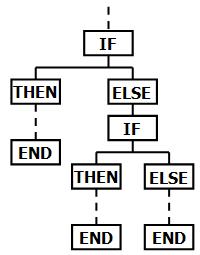

[&larr; Takaisin etusivulle](/)


<h1 class="js-toc-ignore">Totuusarvot ja ehtolauseet</h1>

Tällä tunnilla tutustumme Javan totuusarvoihin `true` ja `false` sekä niihin liittyvään logiikkaan. Opimme vertailemaan eri arvoja toisiinsa ja tekemään vertailun tulosten perusteella ehdollisesti suoritettavaa ohjelmalogiikkaa.

Myöhemmin tällä kurssilla hyödynnämme totuusarvoja ja ehtoja toteuttaessamme toistorakenteita, joissa koodia toistetaan haluamiemme ehtojen mukaisesti.

Katso myös: [Ehtolauseet ja vaihtoehtoinen toiminta, Ohjelmoinnin MOOC 2020](https://ohjelmointi-20.mooc.fi/osa-1/6-ehtolauseet).

**Sisällysluettelo**

<div class="js-toc"></div>


# Oppitunnin videot

Videoiden katsominen edellyttää liittymistä kurssin Teams-ryhmään ja kirjautumista MS Stream -palveluun Haaga-Helian käyttäjätunnuksellasi.

<!-- todo: poista eka video -->

## [Scanner ja DecimalFormat](https://web.microsoftstream.com/video/72835f81-cea0-45e8-b2fe-7deb472eb8fd) *37:23*

<iframe width="640" height="360" src="https://web.microsoftstream.com/embed/video/72835f81-cea0-45e8-b2fe-7deb472eb8fd?autoplay=false&showinfo=true" allowfullscreen style="border:none;"></iframe>

Tällä videolla katsomme, miten käyttäjän teksti- ja numeromuotoisia syötteitä voidaan lukea ja käsitellä Javan **Scanner**-työkalun avulla. Tutustumme lisäksi **DecimalFormat**-työkaluun, jonka avulla voimme määritellä liukulukujen tulostuksessa käytettävän tarkkuuden. Tähän videoon liittyvä teoriaosuus löytyy [ensimmäisen oppitunnin oppimateriaalista](/wiki/Ohjelmoinnin-aloitus).

Lähdekoodit: [SyotteidenLukeminen.java](https://github.com/ohjelmointi1/ohjelmointi1-3012/blob/main/src/viikko01/perusteet/SyotteidenLukeminen.java), 
[NumeroidenLukeminen.java](https://github.com/ohjelmointi1/ohjelmointi1-3012/blob/main/src/viikko01/perusteet/NumeroidenLukeminen.java)

## [Totuusarvot ja vertailuoperaatiot](https://web.microsoftstream.com/video/c1d1f2cd-8d56-4a2c-81d1-7c27caf574bc) *30:04*

<iframe width="640" height="360" src="https://web.microsoftstream.com/embed/video/c1d1f2cd-8d56-4a2c-81d1-7c27caf574bc?autoplay=false&showinfo=true" allowfullscreen style="border:none;"></iframe>

Tällä videolla perehdymme Javan totuusarvioihin sekä erilaisiin vertailuoperaatioihin, joiden tuloksina syntyy totuusarvoja. Määrittelemme totuusarvoja varten `boolean`-muuttujia ja teemme yksinkertaisen `if`-ehtolauseen. 

Lähdekoodit: 
[Totuusarvot.java](https://github.com/ohjelmointi1/ohjelmointi1-3012/blob/main/src/viikko01/ehtorakenteet/Totuusarvot.java), 
[ArvojenVertailu.java](https://github.com/ohjelmointi1/ohjelmointi1-3012/blob/main/src/viikko01/ehtorakenteet/ArvojenVertailu.java),
[Kasino.java](https://github.com/ohjelmointi1/ohjelmointi1-3012/blob/main/src/viikko01/ehtorakenteet/Kasino.java),
[EdullisempiPuoleenHintaan.java](https://github.com/ohjelmointi1/ohjelmointi1-3012/blob/main/src/viikko01/ehtorakenteet/EdullisempiPuoleenHintaan.java),
[EdullisempiPuoleenHintaan2.java](https://github.com/ohjelmointi1/ohjelmointi1-3012/blob/main/src/viikko01/ehtorakenteet/EdullisempiPuoleenHintaan2.java)

## [Kangaskassit-esimerkki (if-else if-else)](https://web.microsoftstream.com/video/d45036ec-153e-4685-b5cc-638ac608a657) *23:41*

<iframe width="640" height="360" src="https://web.microsoftstream.com/embed/video/d45036ec-153e-4685-b5cc-638ac608a657?autoplay=false&showinfo=true" allowfullscreen style="border:none;"></iframe>

Tällä videolla sovellamme totuusarvoja ja ehtolauseita monimutkaisemmassa esimerkissä. Vertailtavalle arvolle määritellään useita toisistaan riippuvia ehtoja. Tehtävän idea perustuu [Ilta-Sanomien artikkeliin](https://www.is.fi/taloussanomat/art-2000006283077.html).

Lähdekoodit: 
[Kangaskassit.java](https://github.com/ohjelmointi1/ohjelmointi1-3012/blob/main/src/viikko01/ehtorakenteet/Kangaskassit.java)


## [Kellonaikojen vertailu ja LocalTime](https://web.microsoftstream.com/video/a0a57cc7-bfa1-46ae-b088-6a01b947d47a) *7:43*

<iframe width="640" height="360" src="https://web.microsoftstream.com/embed/video/a0a57cc7-bfa1-46ae-b088-6a01b947d47a?autoplay=false&showinfo=true" allowfullscreen style="border:none;"></iframe>

Tällä videolla tutustumme siihen, miten voit ohjelmassasi hyödyntää tietokoneen käyttöjärjestelmän kellonaikaa luodessasi ajasta riippuvaista ohjelmalogiikkaa. Videolla käsitellään Viope-tehtävää 2.2 (Tervehdykset).

Lähdekoodit: 
[Tervehdykset.java](https://github.com/ohjelmointi1/ohjelmointi1-3012/blob/main/src/viikko01/ehtorakenteet/Tervehdykset.java)


## [Matkalippujen hinnat -esimerkki](https://web.microsoftstream.com/video/55c3e7f7-f3e3-4c83-b370-dee3635dea83) *20:54*

<iframe width="640" height="360" src="https://web.microsoftstream.com/embed/video/55c3e7f7-f3e3-4c83-b370-dee3635dea83?autoplay=false&showinfo=true" allowfullscreen style="border:none;"></iframe>

Tällä videolla käsittelemme esimerkkiä, jossa on peräkkäisiä ehtorakenteita. Videolla koodattava esimerkkiohjelma selvittää [HSL:n lippuhinnaston](https://www.hsl.fi/liput-ja-hinnat) ja mahdollisten opiskelija-alennusten perusteella, kannattaako käyttäjän ostaa julkisen liikenteen kausilippu vai kertalippuja.

Lähdekoodit: 
[MatkalippujenHinnat.java](https://github.com/ohjelmointi1/ohjelmointi1-3012/blob/main/src/viikko01/ehtorakenteet/MatkalippujenHinnat.java)


# Totuusarvot (boolean)

Javassa on kaksi totuusarvoa: `true` ja `false`, jotka ovat tyypiltään `boolean`:

```java
boolean tosi = true;
boolean epatosi = false;
```

Boolean-tyyppisiä arvoja voidaan monella tapaa käyttää kuten numeroita ja merkkijonoja. Niitä voidaan esimerkiksi tulostaa ja asettaa muuttujiin:

```java
System.out.println(true);
System.out.println(false);

boolean totuusmuuttuja = true;
System.out.println(totuusmuuttuja);
```

Boolean arvojen kääntäminen, eli negaatio, tapahtuu `!`-operaattorin avulla:

```java
boolean yes = true;
boolean no = !yes; // saa arvoksi false
```

## Arvojen vertailu ja loogiset operaatiot

Kun vertailemme Javassa eri arvoja, saamme vertailun tuloksiksi aina totuusarvoja. Tätä voidaan kokeilla suoraviivaisesti esimerkiksi vertailemalla lukuja toisiinsa `>`- ja `<`-operaatioilla: 

```java
System.out.println(10 > 5);  // true
System.out.println(100 < 3); // false
```

Vertailujen tuloksena muodostuvia totuusarvoja voidaan myös asettaa muuttujiin:

```java
// oletetaan, että lukija on edelliseltä oppitunnilta 
// tuttu Scanner-olio
int numero = lukija.nextInt(); 

boolean yliKolme = numero > 3;
boolean alleSata = numero < 100;
```
Muuttujien avulla voidaan toteuttaa esimerkiksi erilaisia ehtorakenteita.

## Vertailuoperaattorit

Javassa löytyy arvojen vertailuun seuraavat operaattorit:

Operaattori | Selitys
------------|-----------
==          | yhtä suuri kuin
!=          | eri suuruinen kuin
&gt;        | suurempi kuin
&gt;=	    | suurempi tai yhtä suuri kuin
&lt;	    | pienempi kuin
&lt;=	    | pienempi tai yhtä suuri kuin
&&	        | ja
\|\|        | tai
!           | negaatio

Lähde: [https://docs.oracle.com/javase/tutorial/java/nutsandbolts/op2.html](https://docs.oracle.com/javase/tutorial/java/nutsandbolts/op2.html)

Kaikki seuraavan esimerkin muuttujat saavat arvoikseen `true`, eli vertailujen tulokset ovat tosia:

```java
int luku = 1;

boolean tosi1 = luku == 1;
boolean tosi2 = luku > 0;
boolean tosi3 = luku < 2;
boolean tosi4 = luku >= 1;
boolean tosi5 = luku <= 1;
boolean tosi6 = luku != 0;
```

Vastaavasti tässä esimerkissä `taysiIkainen`-muuttujan arvo riippuu `ika`-muuttujan suuruudesta:

```java
boolean taysiIkainen = ika >= 18;
```

# If-ehtolause

Totuusarvojen yleinen käyttötarkoitus on koodin suorittaminen vain tietyn ehdon täyttyessä. Tällöin tietyt koodirivit suoritetaan ainoastaan silloin, kun niille asetettu ehto toteutuu.

Tarkastettava ehto kirjoitetaan `if`-avainsanan jälkeen sulkujen sisään: `if (ehto)`. Ehdon toteutuessa suoritettavat koodirivit kirjoitetaan uuteen koodilohkoon `{  }` heti `if`-lauseen jälkeen:

```java
if (ehto) {
    // ehdollisesti suoritettava koodi
}
```

Ehtona on aina oltava totuusarvo tai totuusarvon saava lauseke, esimerkiksi:

```java
boolean taysiIkainen = ika >= 18;

if (taysiIkainen) {
    // tähän lohkoon kirjoitettu koodi suoritetaan 
    // vain, jos taysiIkainen sai arvon true
    System.out.println("Olet täysi-ikäinen");
}
```

If-lauseen sulkujen sisällä voi olla myös lauseke, joka suoritetaan (evaluoidaan) ensin, ja päätös tehdään saadun tuloksen mukaan.

```java
if (ika >= 18) {
    // tähän lohkoon kirjoitettu koodi suoritetaan 
    // vain, jos vertailu sai arvon true
    System.out.println("Olet täysi-ikäinen");
}
```

## Vertailu "== true"

Toisinaan ehtolauseen sisään saatetaan kirjoittaa jonkin arvon vertailu `true`-arvoon:

```java
if (taysiIkainen == true) {
    // ...
}
```

Tämä on kuitenkin turhaa, koska `taysiIkainen == true` saa aina arvokseen saman arvon kuin `taysiIkainen`. Voimme käyttää siis aina suoraan `taysiIkainen`-muuttujan arvoa:

```java
if (taysiIkainen) {
    // ...
}
```

# Ehtojen yhdistäminen

Totuusarvoja voidaan yhdistellä ja- sekä tai-operaatioilla. Näiden operaatioiden molempien osapuolien on oltava totuusarvoja tai lausekkeita, joiden tuloksena saadaan totuusarvo.

## Ja

Ehdon "a ja b" (`a && b`) arvoksi tulee `true` vain silloin, kun **molemmat puolet** ovat tosia. 

Esimerkiksi, jos kesäkuukausiksi lasketaan kesä, heinä ja elokuu, voidaan `onKesa`-muuttujan logiikassa hyödyntää `&&`-operaatiota:

```java
boolean onKesa = kuukausi >= 6 && kuukausi <= 8;
```

Ja-operaation tulos voidaan esittää kahden arvon yhdistelmien avulla taulukkona siten, että vasemmalla olevien `a`:n ja `b`:n kaikkien arvojen yhdistelmien perusteella esitetään kyseisten arvojen ja-operaation tulos `a && b`:

| a     | b     | a &amp;&amp; b |
|-------|-------|--------  |
| true  | true  | true     |
| true  | false | false    |
| false | true  | false    |
| false | false | false    |


## Tai

Ehdon "a tai b" (`a || b`) arvoksi tulee `true` aina, kun **vähintään toinen arvoista** on `true`:

Esimerkiksi, jos talvikuukausiksi lasketaan tammi-, helmi-, marras- ja joulukuu, tarvitaan kesän logiikasta poiketen `||`-operaatiota:

```java
boolean onTalvi = kuukausi <= 2 || kuukausi >= 11;
```

Tai-operaation tulos voidaan esittää kahden arvon yhdistelmien avulla taulukkona siten, että vasemmalla olevien `a`:n ja `b`:n kaikkien arvojen yhdistelmien perusteella esitetään kyseisten arvojen tai-operaation tulos `a || b`:

| a     | b     | a \|\| b |
|-------|-------|----------|
| true  | true  | true     |
| true  | false | true     |
| false | true  | true     |
| false | false | false    |


## Ehtorakenteet (ja)

Ehtolauseessa voidaan suorittaa (evaluoida) myös monimutkaisempia lausekkeita, joissa tehdään useita eri vertailuja:

```java
int kello = 16;

if (kello >= 10 && kello < 18) {
    // tähän lohkoon kirjoitettu koodi suoritetaan vain,
    // jos molemmat &&-operaation ympärillä olevat ehdot toteutuvat
    System.out.println("Hyvää päivää!");
}
```

Edellä oleva ehto toteutuu vain, jos `kello` on samaan aikaan sekä suurempi tai yhtä suuri kuin 10 ja pienempi kuin 18. 


## Ehtorakenteet (tai)

Vuorokaudenajoista yö asettuu sekä järjestysnumeroltaan pienille että suurille tunneille. Tällainen ehto voidaan tarkistaa yhdistelemällä kaksi vertailua tai-operaatiolla:

```java
int kello = 16;

if (kello >= 22 || kello < 7) {
    // tähän lohkoon kirjoitettu koodi suoritetaan
    // jos kumpi tahansa ehdoista toteutuu!
    System.out.println("Hyvää yötä!");
}
```

Erilaisia ehtoja voidaan kirjoittaa myös ehtorakenteiden ulkopuolelle, jolloin niiden tulokset voidaan esimerkiksi sijoittaa muuttujiin:

```java
// vertailu suoritetaan ensin ja sen tulos asetetaan muuttujaan:
boolean onPaiva = kello >= 10 && kello < 18;
boolean onYo = kello >= 22 || kello < 7;

// sama kuin aikaisemmin, mutta muuttujan avulla:
if (onPaiva) {
    System.out.println("Hyvää päivää!");
}

// sama kuin aikaisemmin, mutta muuttujan avulla:
if (onYo) {
    System.out.println("Hyvää yötä!");
}
```

Vertailujen ympärillä voidaan käyttää aina myös sulkuja. Tarkoituksenmukainen välilyöntien ja sulkujen hyödyntäminen helpottaa koodin lukemista ja vähentää virheiden mahdollisuuksia:

```java
boolean vaikeaLukea=kello>=10&&kello<18; // vaikea lukea
boolean helpompiLukea = (kello >= 10) && (kello < 18);  // hieman helpompi lukea
```

## Oikean kellonajan käyttäminen Java-ohjelmassa 🕒

Edellisissä esimerkeissä esitetty kellonajan "kovakoodaaminen" tai kysyminen käyttäjältä eivät vastaa tavanomaisen ohjelman oikeaa toimintalogiikkaa. Oikeaa kellonaikaa voidaan käyttää esimerkiksi seuraavalla tavalla Javan `LocalTime`-luokan avulla. 

Lisää ensin `import`-käsky tiedoston alkuun mahdollisen `package`-rivin alapuolelle, jotta voit käyttää `LocalTime`-luokkaa:

```java
import java.time.LocalTime;
```

Sen jälkeen voit luoda `LocalTime`-olion ja käyttää sitä kellonajan selvittämiseksi:

```java
// luodaan olio ja asetetaan se uuteen muuttujaan:
LocalTime nykyhetki = LocalTime.now();

// kutsutaan getHour-metodia ja otetaan vastaus talteen:
int tunnit = nykyhetki.getHour();

if (tunnit >= 10 && tunnit < 18) {
    // tähän lohkoon kirjoitettu koodi suoritetaan vain,
    // jos tunnit-muuttujan arvo on suurempi tai 
    // yhtä suuri kuin 10, mutta kuitenkin alle 18
    System.out.println("Hyvää päivää!");
}
```

# Else-lohko

Usein ohjelmissa on tarpeen tehdä joko-tai-tyyppistä logiikkaa. Tämä tapahtuu helpoiten `if-else`-rakenteen avulla.

If-ehtorakenteen jälkeisessä vapaaehtoisessa `else`-lohkossa oleva koodi suoritetaan, mikäli if-lauseen ehto ei toteutunut:

```java
int tunnit = nykyhetki.getHour(); // katso edellinen esimerkki

if (tunnit >= 8 && tunnit < 16) {
    System.out.println("Työskentele ahkerasti!");
} else {
    // Tässä lohkossa oleva koodi suoritetaan, jos 
    // edellä ollut if-ehto ei toteutunut 
    System.out.println("Vapaa-aika 🥳!");
}
```

`else`-avainsana koodilohkoineen kirjoitetaan aina heti `if`-lohkon jälkeen.


## if / else if / else

`else if`-lohkossa oleva koodi suoritetaan, jos edeltävien ehtolauseiden ehdot eivät ole toteutuneet ja tämän ehtorakenteen ehto toteutuu:

```java
int kello = 16;

if (kello >= 22) { // tämä tarkastus tehdään aina ensin
    System.out.println("Hyvää yötä!");
} else if (kello >= 17) { // tämä ehto tarkastetaan, jos ensimmäinen oli epätosi
    System.out.println("Hyvää iltaa!");
} else {
    // tänne päädytään, jos kaikki edellä olleet if-ehdot olivat epätosia
    System.out.println("Hyvää päivää!");
}
```

`if-else if-else` -ketjun ehtojen tarkastaminen päättyy aina ensimmäiseen `true`-arvon saaneeseen vertailuun.


## Koodaustehtävä (ks. Viope)

Kirjoita luokka `Tervehdys` ja siihen `main`-metodi, joka tulostaa kellonajasta riippuen erilaisen tervehdyksen.

Aikaväli    | Tervehdys
---------   |----------
7:00-9:59   | Hyvää huomenta!
10:00-16:59 | Hyvää päivää!
17:00-21:59 | Hyvää iltaa!
22:00-6:59  | Hyvää yötä!

Vinkki: Koska tässä tehtävässä tervehdys muuttuu aina tasatunnein, sinun ei tarvitse ottaa minuutteja lainkaan huomioon ehtorakenteessasi.


## Sisäkkäiset ehtorakenteet

Ohjelmissa on toisinaan tarpeen tehdä sisäkkäisiä ehtorakenteita. Tällöin sisempi ehtorakenne jää kenties kokonaan suorittamatta ulomman ehtorakenteen arvosta riippuen. Tällainen tilanne saattaisi tulla vastaan esimerkiksi Viope-tehtävässä, jossa lasketaan katsastusasemalla käynnin hinta riippuen päästömittauksista, ajoneuvon polttoainetyypistä ja mahdollisesta jälkitarkastuksesta.

Tehtävässä ehtologiikka kannattaa ensin luonnostella kaavioksi, jossa lähdet liikkeelle yksinkertaisimmasta tapauksesta (jälkitarkastus) ja etenet vaihe kerrallaan päästömittauksen ja polttoainetyypin kyselyihin.

[](https://en.wikipedia.org/wiki/Conditional_(computer_programming))

*Kuva: A nested "If–Then–Else" flow diagram by Snubcube. CC BY-SA 3.0. [Wikipedia](https://en.wikipedia.org/wiki/Conditional_(computer_programming)#/media/File:IF-THEN-ELSE-END_flowchart.svg)*

<!--```java
int hinta = 0;

if (jalkitarkastus) {
    hinta = 30;
} else {
    hinta = 50;

    // mitataanko päästöt?`
    // ...

    if (mitataanPaastot) {
        // bensa vai diesel?
        // ...
        if (bensa) {
            hinta += 22;
        } else {
            hinta += 31;
        }
    }
}
```-->


# Eri tapoja vertailla: ==, !=, ! ja == false

Tulet ohjelmakoodia lukiessasi ja kirjoittaessasi törmäämään erilaisiin tapoihin toteuttaa samat loogiset ehdot. Tutustu esimerkiksi seuraaviin vertailuihin:

```java
boolean onKesa = kuukausi >= 6 && kuukausi <= 8;

// Seuraavat kaksi ehtoa ovat loogisesti samat:
if (onKesa == true) {
    System.out.println("Muista aurinkorasva!");
}

if (onKesa) {
    System.out.println("Muista aurinkorasva!");
}
```

Kaikissa seuraavissa ehtorakenteissa ehto toteutuu, mikäli muuttujan arvo on `false`:

```java
boolean onKesa = kuukausi >= 6 && kuukausi <= 8;

// Seuraavat kolme ehtoa ovat loogisesti samat:
if (onKesa == false) {
    System.out.println("Pukeudu lämpimästi!");
}

if (onKesa != true) {
    System.out.println("Pukeudu lämpimästi!");
}

if (!onKesa) {
    System.out.println("Pukeudu lämpimästi!");
}
```

# Syventävää osaamista: ehdollinen lauseke 🌶

"Normaalien" if-else-rakenteiden lisäksi Javassa ja monissa muissa kielissä on ns. ehdollinen lauseke (ternary operator), jonka avulla voidaan laskea kompaktissa muodossa yksittäinen ehdollinen arvo. Tällaisen lausekkeen syntaksi seuraava:

```java
ehto ? arvoJosTosi : arvoJosEpatosi;
```

Jos haluamme esimerkiksi valita koodissa matkalipun hinnaksi 40 euroa (opiskelija) tai 60 euroa (normaali), voitaisiin se tehdä "perinteisellä" tavalla näin:

```java
// oletetaan, että `boolean opiskelija` on määritetty aiemmin
int hinta;
if (opiskelija) {
    hinta = 40;
} else {
    hinta = 60;
}
```

Ehdollisella lausekkeella koodi tulee kuitenkin merkittävästi suoraviivaisemmaksi:

```java
// oletetaan, että `boolean opiskelija` on määritetty aiemmin
int hinta = opiskelija ? 40 : 60;
```

Voit halutessasi lukea aiheesta lisää esim. osoitteesta [https://www.baeldung.com/java-ternary-operator](https://www.baeldung.com/java-ternary-operator).

# Syventävää osaamista: switch/case -rakenne 🌶

Edellä esitettyjen `if`-rakenteiden lisäksi on olemassa myös toinen vaihtoehto, `switch`, johon sinun kannattaa tutustua itsenäisesti esimerkiksi osoitteessa [https://www.educative.io/edpresso/how-to-use-switch-case-statement-in-java](https://www.educative.io/edpresso/how-to-use-switch-case-statement-in-java).

```java
/** By Educative, Inc 
 * https://www.educative.io/edpresso/how-to-use-switch-case-statement-in-java
 * License: Creative Commons -Attribution -ShareAlike 4.0 (CC-BY-SA 4.0)*/
class HelloWorld {
    public static void main( String args[] ) {
      
        int weather = 2;
        //passing variable to the switch
        switch (weather) {
          //comparing value of variable against each case
        case 0:
          System.out.println("It is Sunny today!");
          break;
        case 1:
          System.out.println("It is Raining today!");
          break;
        case 2:
          System.out.println("It is Cloudy today!");
          break;
        //optional
        default:
          System.out.println("Invalid Input!");
        }
    }
}
```

---

Tämän oppimateriaalin on kehittänyt Teemu Havulinna ja se on lisensoitu [Creative Commons BY-NC-SA](https://creativecommons.org/licenses/by-nc-sa/4.0/) -lisenssillä.


<script src="/tocbot/tocbot.min.js"></script>
<script src="/scripts.js"></script>
<link rel="stylesheet" href="/tocbot/tocbot.css">