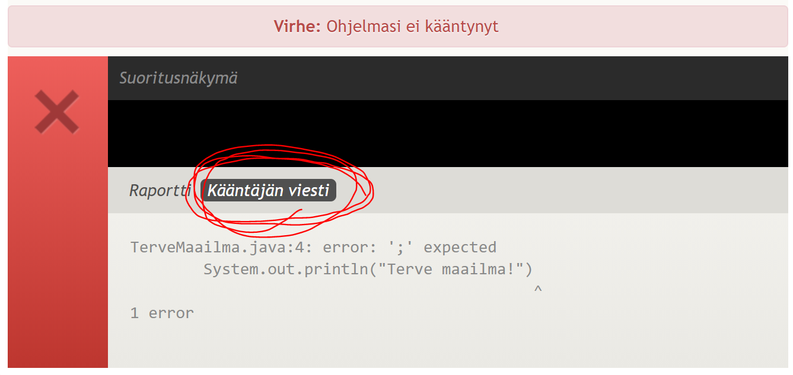

# Vinkkejä Viope-virhetilanteisiin

## "Could not find or load main class"

> Error: Could not find or load main class TerveMaailma
> Caused by: java.lang.NoClassDefFoundError: viikko1/perusteet/th/TerveMaailma (wrong name: TerveMaailma)

Viope ei löydä ratkaisusi luokkaa (`class`). Tarkasta, että olet poistanut `package`-rivin ohjelmasi alusta Viopessa.

## "Virhe tulostuksessa"

> Virhe tulostuksessa: ohjelmasi tulosti "maailma", vaikka tulostuksen olisi pitänyt olla "maailma!"

Vertaile merkki kerrallaan oman ohjelmasi tulostetta esimerkkitulosteeseen. Onko välimerkeissä tai numeroissa eroja? Entä kirjoitusvirheitä?

## "Virhe: ohjelmasi ei kääntynyt"

Avaa Viopessa näkyville Java-kääntäjän antama virhe klikkaamalla "Kääntäjän viesti"-painiketta:

Kääntäjän viesti kertoo missä kohdassa koodiasi virhe on.

<a href="https://video.haaga-helia.fi/media/K%C3%A4%C3%A4nt%C3%A4j%C3%A4n+virheilmoitukset+Viopessa/0_tpfd5pfd">Video: Kääntäjän virheilmoitukset Viopessa.</a>